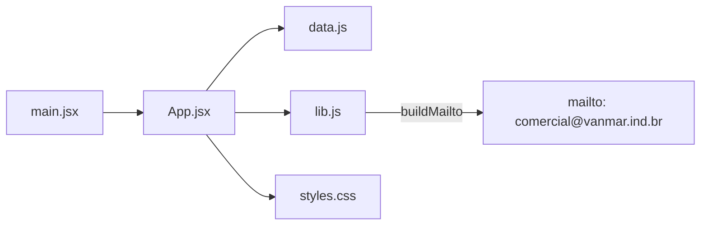

# Arquitetura — site Vanmar

```mermaid
flowchart LR
  main.jsx --> App.jsx
  App.jsx --> data.js
  App.jsx --> lib.js
  App.jsx --> styles.css
  lib.js -->|buildMailto| Mail[mailto: comercial@vanmar.ind.br]
```

Site estático (Vite + React), publicado no GitHub Pages por `.github/workflows/deploy.yml`.
CSS mobile-first (apenas `min-width`). Testes: `npm test`.
